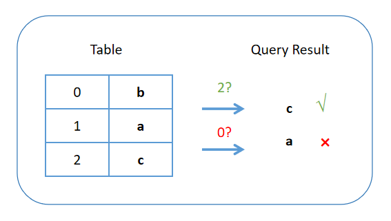

# LogUp
A LogUp circuit verifies the query of a table, ensuring the result is correct, as illustrated below:



Let's say we have a table of $N$ values, denoted as $t_i, i\in [T]$, and we have $M$ queries of the table, whose results are denoted as $q_j, j\in [M]$, we'd like to proving the following relationship:

There exists $c_i, i\in [T]$, s.t.

$$
\sum_{i\in [T]} \frac{c_i}{X - t_i} = \sum_{j\in [M]} \frac{1}{X - q_j}
$$

Thanks to the Schwartz–Zippel lemma, we can sample a random value $\alpha\in\mathbb{F}$ and conclude that the two polynomials are equal with high probability if they agree at $\alpha$.

## Concrete Definition
In practice, things get a little more complex since the query key can be arbitrary, and there might be more than one values in the row of a table.

```rust
pub struct LogUpParams {
    pub key_len: usize,
    pub value_len: usize,
    pub n_table_rows: usize,
    pub n_queries: usize,
}

declare_circuit!(_LogUpCircuit {
    table_keys: [[Variable]],
    table_values: [[Variable]],

    query_keys: [[Variable]],
    query_results: [[Variable]],

    // counting the number of occurences for each row of the table
    query_count: [Variable],
});

```

We fully parameterized this, allowing arbitrary ```key_len```, ```value_len```, ```n_table_rows```, and ```n_queries```.

## Circuit Short Explaination
1. ```table_keys``` and ```table_values``` are concated in the second dimension.
2. ```query_keys``` and ```query_values``` are concated in the second dimension.
3. The second dimension will be reduced to a single value with randomness.
4. At this point, we have a list of $t_i$ and $q_j$ now, and we proceed with the LogUp argument.

Thanks to the [Expander](https://github.com/PolyhedraZK/Expander) prover, we're able to use random gate in the construction of the ciruict, whose value will be filled via fiat-shamir hash in proving. 

## Test
```rust
#[test]
fn logup_test() {
    let logup_params = LogUpParams {
        key_len: 7,
        value_len: 7,
        n_table_rows: 123,
        n_queries: 456,
    };

    common::circuit_test_helper::<BN254Config, LogUpCircuit>(&logup_params);
    common::circuit_test_helper::<M31Config, LogUpCircuit>(&logup_params);
    common::circuit_test_helper::<GF2Config, LogUpCircuit>(&logup_params);
}
```

To see how ```circuit_test_helper``` is defined, please refer to our documentation of the [std library](../rust/std.md)